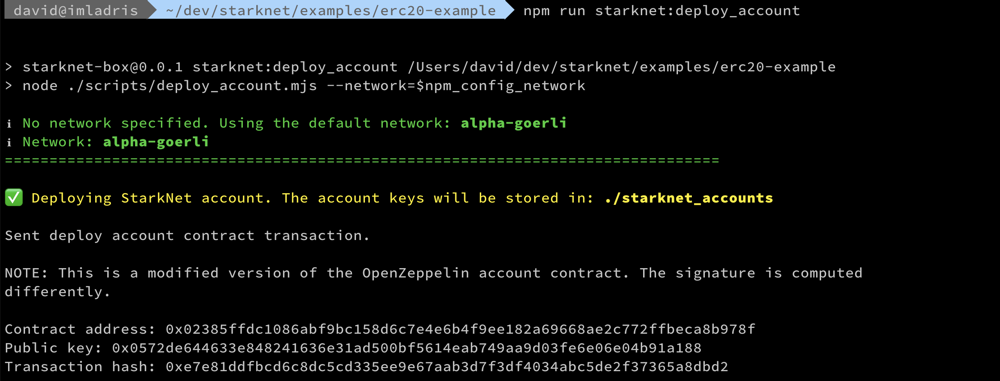
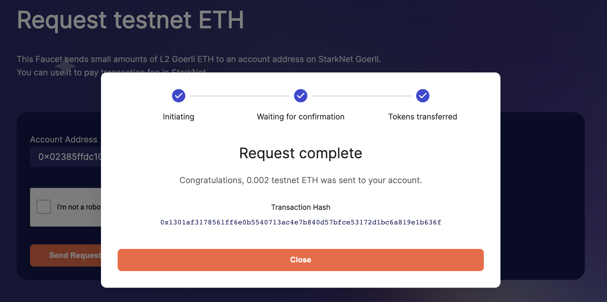
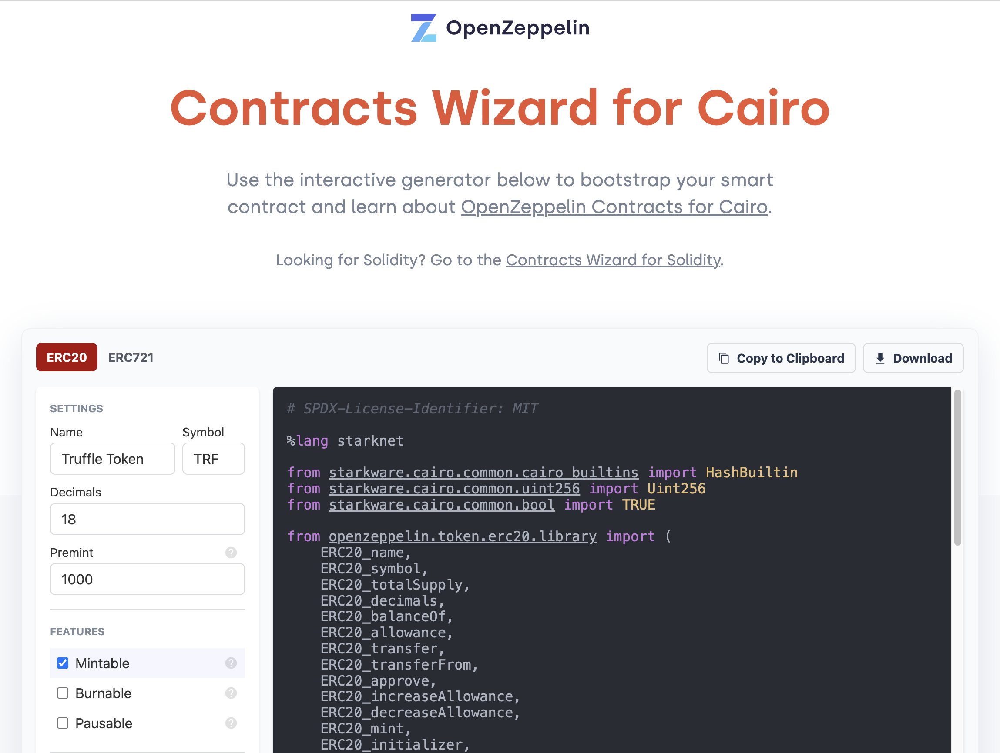
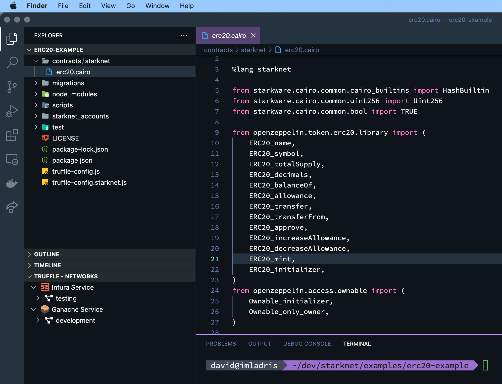

# Building for StarkNet with Truffle

Written by [David Killen](https://twitter.com/DavidAKillen)

## Overview

Today, we are going to lead you through deploying, and interacting with, your own ERC20 token on [StarkNet](https://starknet.io/) using Truffle's [StarkNet Box](https://github.com/truffle-box/starknet-box). If your friends and family have been incessently asking you "Wen token?", now's your chance to give it to them. To the moon!

### What is StarkNet?

StarkNet is a permissionless decentralized Validity-Rollup (ZK-Rollup). StarkNet operates as a Layer 2 network over Ethereum, enabling any dApp to achieve unlimited scale for its computation – without compromising Ethereum’s composability and security.

### The Cairo Language

StarkNet Contracts are written in Cairo. Cairo is a programming language for writing provable programs, that is, a program where one party can prove to another that a certain computation was executed correctly. Cairo and similar proof systems can be used to provide scalability to blockchains. StarkNet uses the Cairo programming language both for its infrastructure and for writing StarkNet contracts. More information about StarkNet and Cairo, including some tutorials, can be found in the [StarkNet and Cairo documentation](https://starknet.io/docs/index.html).

## Introducing the StarkNet Box

In this guide, we will use Truffle's new StarkNet Box. The StarkNet Box is a proof of concept box. The box has been built with the intention of better understanding StarkNet development and exploring how StarkNet development can be supported by Truffle. Further detail about using the StarkNet Box can be found in [StarkNet Box GitHub repository](https://github.com/truffle-box/starknet-box).

### What's in the Box?

The StarkNet Box gathers together several tools and resources that are necessary and helpful in developing for StarkNet. These tools are provided in two Docker images which the StarkNet Box will pull from a Docker Hub repository if necessary. First, the box provides a command line interface for compiling, deploying, testing and interacting with your contracts. Second, the box includes the [OpenZeppelin Cairo contracts](https://github.com/OpenZeppelin/cairo-contracts) library to help in developing StarkNet contracts and the [pytest](https://docs.pytest.org/en/7.1.x/index.html) library for writing and running unit tests. The StarkNet Box also makes use of the [StarkNet Devnet Docker image](https://hub.docker.com/r/shardlabs/starknet-devnet) to provide a StarkNet network for development testing. 

## Prerequisites

### System Requirements

At the very least, you will need the following to use the StarkNet Box:

- [Node.js](https://nodejs.org/) 14.18.2 or later
- [NPM](https://docs.npmjs.com/cli/) version 6.14.15 or later
- [truffle](https://trufflesuite.com/docs/truffle/getting-started/installation/?utm_source=blog&utm_medium=post&utm_campaign=2022_May_truffle-blog-nft-marketplace_acquisition_content)

- [Docker](https://docs.docker.com/get-docker/), version 20.10.10 or later
- Recommended Docker memory allocation of >=8 GB.
- Windows, MacOS or Linux

**Important Note:** The scripts included in the StarkNet Box rely on Docker being available and running. On Linux you may need to have Docker configured to [run the Docker daemon in 'rootless' mode](https://docs.docker.com/engine/security/rootless/).

### Docker

The StarkNet Box relies heavily on Docker. All the tools used in developing StarkNet contracts are supplied in two Docker images. For this reason, you must have Docker installed and running to use the StarkNet Box. If you don't already have Docker installed, follow the installation instructions for your operating system [here](https://docs.docker.com/get-docker/).

## Set Up the Project

### Unboxing the StarkNet Truffle Box

Now that you have all the prerequisites set up, the first thing to do is to create a directory for your project and unbox the StarkNet box.

First, create a directory for the project and change to the newly created directory. For example:

```bash
mkdir erc20-example
cd erc20-example
```

Next, unbox the StarkNet Box in the project directory:

```bash
truffle unbox https://github.com/truffle-box/starknet-box
```

This will download the box and generate a StarkNet project for you.

### Configuration Files

The StarkNet box contains two separate sets of configuration that can be used to configure development for Ethereum and StarkNet. We will focus on the StarkNet configuration in this guide.

The configuration of the StarkNet box can be found in `truffle-config.starknet.js` in your main project directory. The contents of the configuration file should look very similar to the following:

```javascript
require('dotenv').config();

module.exports = {

  /**
  *  contracts_directory tells Cairo where to find your contracts
  */
  contracts_directory: './contracts/starknet',

  /**
  * contracts_build_directory tells Cairo where to store compiled contracts
  */
  contracts_build_directory: './build/starknet-contracts',

  /**
   * starknet_accounts_directory tells Cairo where the StarkNet account keys are located.
   * WARNING: accounts deployed using keys stored in this directory are for development and testing only.
   * DO NOT use any account deployed using keys stored here in production, or you risk having all your funds stolen.
   * You should also add this directory to a .gitignore file to avoid making your keys publicly available.
   */
  starknet_accounts_directory: './starknet_accounts',

  networks: {
    testnet: {
      network_id: "alpha-goerli",
    },
    // mainnet: {
    //   network_id: "alpha-mainnet"
    // },
    devnet: {
      network_id: "devnet",
      gateway_url: "http://starknet-devnet:5050/gateway/",
      feeder_gateway_url: "http://starknet-devnet:5050/feeder_gateway/"
    },
    default: {
      network: "testnet",
    },
  },
  // Configure your Cairo compilers
  compilers: {
    cairo: {
      repository: "trufflesuite/cairo-starknet-cli",  // Docker Hub repository
      version: "0.8.2",                               // Version tag
    }
  },
  // Configuration for StarkNet DevNet
  devnet: {
    repository: "shardlabs/starknet-devnet",  // Docker Hub repository
    version: "0.2.1",                        // Version tag
  },

};
```

**Directories**

The configuration file specifies three important directories:

1. `contracts_directory` - the directory in which your StarkNet contract source code (.cairo) files can be found.
2. `contracts_build_directory` - the directory to which the compilation artifacts will be saved.
3. `starknet_accounts_directory` - the directory in which account information will be saved.

**Networks**

The configiuration file specifies several StarkNet networks which may be the target of various operations. You will note that they are of two different types. 

First are the StarkNet networks configuration, which look like this:

```javascript
testnet: {
  network_id: "alpha-goerli",
},
```

Second is the StarkNet Devnet, which looks like this:

```javascript
devnet: {
  network_id: "devnet",
  gateway_url: "http://starknet-devnet:5050/gateway/",
  feeder_gateway_url: "http://starknet-devnet:5050/feeder_gateway/"
},
```

The StarkNet network that is to be the target of a command line operation can be referred to by the name specified in the `network_id` property. For example: `--network=devnet` or `--network=testnet`.

Finally, the networks configuration also allows you to set a default network. If a default is set in the configuration, you won't need to specify the target network as an argument on the cli. You can configure your default network like this:

```javascript
default: {
  network: "testnet",
},
```

By default, the box's default network is `testnet` which is configured to point to the `alpha-goerli` network.

**Compiler and Devnet**

In this Truffle box, the StarkNet command line compiler is provided in a Docker image which will be pulled from the [Docker Hub](https://hub.docker.com/repository/docker/trufflesuite/cairo-starknet-cli) if it is not present. Likewise, this box uses a Docker image to provide the Devnet development network which is useful for testing your StarkNet contracts during development. The Docker Hub repository and version tags for both are configured as follows:

```javascript
  // Configure your Cairo compilers
  compilers: {
    cairo: {
      repository: "trufflesuite/cairo-starknet-cli",  // Docker Hub repository
      version: "0.8.2",                               // Version tag
    }
  },
  // Configuration for StarkNet DevNet
  devnet: {
    repository: "shardlabs/starknet-devnet",  // Docker Hub repository
    version: "0.2.1",                         // Version tag
  },
```

## StarkNet Accounts

Externally Owned Accounts on StarkNet differ from those of the Ethereum network. A StarkNet account requires the deployment of an account contract to the StarkNet network. The StarkNet CLI provides a simple method of deploying an account contract for development purposes. This currently uses a modified version of the OpenZeppelin Cairo account contract. The `truffle-config.starknet.js` configuration file defines a location for storing account information for accounts deployed while using the box. By default this is the ./starknet_accounts directory. **You should ensure that this directory is included in your project's .gitignore file to avoid accidentally commiting your account keys to a public source code repository.**

Accounts deployed with this box have their own location and configuration seperate to any other StarkNet accounts that you may have deployed in another StarkNet environment. Currently, this box only supports the deployment of a single default account which will be used for any interactions where an account is necessary or desirable.

**WARNING: never use an account deployed with the StarkNet CLI in production as its private key is stored on your system in plaintext. It can be easily compromised and your funds stolen.**

### Deploying an Account Contract

First, we want to deploy an account to the StarkNet Alpha Goerli network. We do that with the following command. In a terminal in your project's root directory, type the following:

```bash
npm run starknet:deploy_account
```

The output of the `deply_account` command should look very similar to this:



The account's private keys will be stored in the `./starknet_accounts` directory. You won't need to do anything further to use this account with the box, it is configured to look for your account keys in this location.
### Funding your Account

Now that you have your account, you need some funds to pay transaction fees. To do so you will need to copy the account contract address from the output of your account deployment. So, don't close your terminal just yet.

First, go to the [StarkNet Alpha Goerli faucet](https://faucet.goerli.starknet.io/), then copy and paste your account address into the space provided, check the box to confirm that you're not a robot and send your request. 


Once a transaction has been initiated a link to the transaction on [StarkNet Voyager](https://goerli.voyager.online/), StarkNet's block explorer, will be displayed to you. You can click on the link to view the transaction if you wish. After a couple of minutes the transaction should complete and a small amount of testnet ETH will be sent to your account. You can do this a few times if you need to.



## The ERC20 Contract

Now that we have deployed an account and funded it, it's time to get started on our ERC20 contract. In this guide we are just going to deploy a simple mintable ERC20 contract. To simplify the creation of our ERC20 contract we will use the [OpenZeppelin Contract Wizard for Cairo](https://wizard.openzeppelin.com/cairo).

On the Contract Wizard for Cairo page, make sure that you have selected ERC20 as your contract on the top left. Then, in the Settings section, give your token a name and a symbol. Leave the decimals at 18. For this guide we have called our token `Truffle Token` and given it a symbol of `TRF`. We have also chosen to premint 1000 tokens for an initial recipient. Finally, in the Features section, check the mintable feature. Once you have entered a name, a symbol, a premint amount, and selected the mintable feature, click on the `Copy to Clipboard` button on the top right.



In this guide we will use the [Visual Studio Code](https://code.visualstudio.com/) (VSCode) as our source code editor. You can use another if you are more comfortable with it. In your terminal, type the following in your project's root directory.

```bash
code .
```

This will open VSCode with your project's files and directories visible in the pane to the left.

The StarkNet Truffle box is configured to look for `.cairo` source code files in the `contracts/starknet` directory of your project. This is where we will create our ERC20 contract. Create a new file in this directory and name it ERC20.cairo and paste the code copied from the OpenZeppelin Contract Wizard into the editor and save it. When you're done, it should look something like this:



## Compiling the ERC20 Contract

The next step is to compile our contract. In either your terminal or the terminal pane of VSCode, type the following:

```bash
npm run starknet:compile
```

This will compile your Cairo contract and save the compilation artifacts to the `build` directory. You should see output similar to the following:


You should also notice that the compiled contract and the contract ABI file have been saved to the `build` directory.


## Testing the ERC20 Contract

## Deploying the ERC20 Contract

### Strings in StarkNet Contracts

### Deploying to StarkNet Devnet

### Deploying to StarkNet Alpha Goerli

## Interacting with the ERC20 Contract

### StarkNet Voyager

### Minting Tokens

### Transferring Tokens

## Final Notes

1. [Truffle's StarkNet Box](https://github.com/truffle-box/starknet-box)
1. [StarkNet](https://starknet.io/)
1. [OpenZeppelin Cairo Contracts](https://github.com/OpenZeppelin/cairo-contracts)
1. [OpenZeppelin Contracts Wizard for Cairo](https://wizard.openzeppelin.com/cairo)